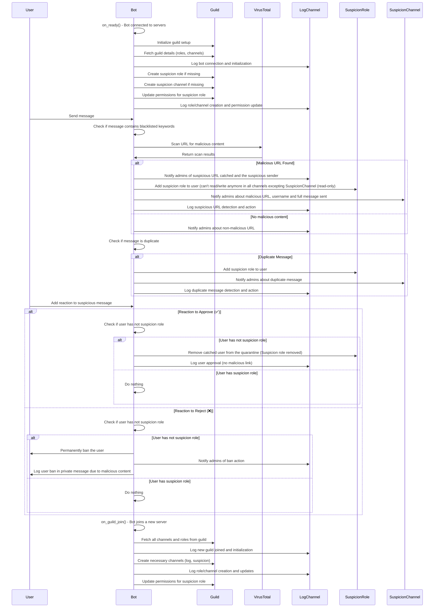

# AdProtect - Discord Bot for Malicious Link Detection and Protection

AdProtect is a Discord bot designed to protect servers from malicious links and potential phishing or advertising attacks. It scans messages in real-time to detect harmful URLs, and provides automatic response (quarantine of malicious actors, message deletions, and logging).<br>
Can work with multiple discord server simultaneously

This bot performs several key actions, including:

- **Malicious Link Detection**: Scans messages for potentially harmful URLs (e.g., phishing links, token grabbers, and blacklisted domains for discord invitations).
- **Suspicious Activity Tracking**: When a malicious link is detected, the bot assigns a `Suspicion` role to the user, restricts their permissions, and informs admins via a dedicated channel.- **Logging**: Automatically logs all detected malicious activity, suspicious messages, and admin actions in a designated log channel.
- **Admin Interaction**: Admins can react to flagged messages with ✅ or ❌ to clear the suspicion or ban the user, respectively.
- **Server Setup**: Automatically sets up necessary roles (make sure to put the bot's role at the top of the discord server roles list to grant maximum privileges), channels, and permissions when the bot joins a server for the first time.
- **Message Duplication Detection**: Prevents repeated spamming or similar malicious links (not detected by VirusTotal scans) by identifying duplicate messages across channels.
- **Detailed Logging**: All actions (message deletions, user role assignments, and reactions) are logged in the server's log channel for full traceability.

## Prerequisites

- Python 3.8+ 
- Dependencies (listed below)
- A Discord bot token (for authentication)
- A VirusTotal API key (for malicious link scanning)

## Installation

1. **Clone the repository**:

   ```bash
   git clone https://github.com/u-damien/discord-link-blocker.git
   cd discord-link-blocker
   ```

2. **Install dependencies**:

   Ensure you have `pip` installed and then run:

   ```bash
   pip install -r requirements.txt
   ```

3. **Set up environment variables**:

   In `.env`, add your Discord bot token and VirusTotal API key:

   ```env
   DISCORD_TOKEN=your_discord_bot_token
   VT_TOKEN=your_virustotal_api_key
   ```

4. **Run the bot**:

   Start the bot by running the following command:

   ```bash
   python3 main.py
   ```

## Configuration

You can configure the bot to your specific needs by modifying the following parameters:

- **Blacklisted URLs**: The bot uses a list of predefined blacklisted keywords and domains. You can customize the list to include more domains that you want to block.
- **Role Permissions**: You can change the permissions for the `Suspicion` role, such as whether it can view channels, send messages, or read messages.

## Contributing

Contributions are welcome! If you would like to contribute to the project, please fork the repository, make your changes, and submit a pull request. Ensure that your changes align with the project's goals and adhere to the project's coding standards.

## License

This project is licensed under the MIT License - see the [LICENSE](https://github.com/u-damien/discord-link-blocker/blob/main/LICENSE) file for details.

---

# Sequence Diagram representation 


