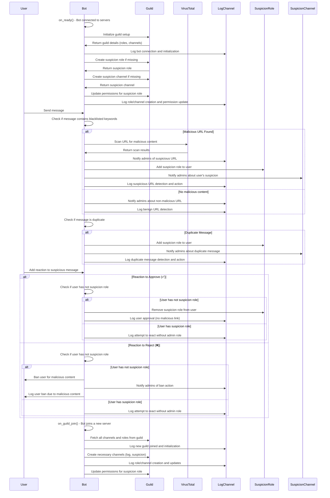

# AdProtect - Discord Bot for Malicious Link Detection and Protection

AdProtect is a Discord bot designed to protect servers from malicious links and potential phishing or advertising attacks. It scans messages in real-time to detect harmful URLs, and provides automatic role assignments, message deletions, and logging to enhance security within the server.<br>
Can work with multiple discord server simultaneously

This bot performs several key actions, including:

- **Malicious Link Detection**: Scans messages for potentially harmful URLs (e.g., phishing links, token grabbers, and blacklisted domains).
- **Suspicion Role & Channel**: Adds a special "Suspicion" role to users sending malicious links and sends notifications to a dedicated suspicion channel for admin review.
- **Logging**: Automatically logs all detected malicious activity, suspicious messages, and admin actions in a designated log channel.
- **Server Setup**: Automatically sets up necessary roles, channels, and permissions when the bot joins a server for the first time.
- **Message Duplication Detection**: Prevents repeated spamming of similar malicious links by identifying duplicate messages across channels.

## Features

- **Real-time Link Scanning**: The bot checks all messages for malicious links and blacklisted URLs, immediately flagging them for review.
- **Suspicious Activity Tracking**: When a malicious link is detected, the bot assigns a `Suspicion` role to the user, restricts their permissions, and informs admins via a dedicated channel.
- **Customizable Permissions**: The bot allows for customizable role and channel permissions to manage suspicious users and ensure the security of your server.
- **Automatic Setup**: On joining a new server, the bot creates required roles and channels (e.g., log channels and suspicion channels) to streamline security management.
- **Admin Interaction**: Admins can react to flagged messages with ✅ or ❌ to clear the suspicion or ban the user, respectively.
- **Detailed Logging**: All actions (message deletions, user role assignments, and reactions) are logged in the server's log channel for full traceability.

## Prerequisites

- Python 3.8+ 
- Dependencies (listed below)
- A Discord bot token (for authentication)
- A VirusTotal API key (for malicious link scanning)

## Installation

1. **Clone the repository**:

   ```bash
   git clone https://github.com/u-damien/discord-link-blocker.git
   cd discord-link-blocker
   ```

2. **Install dependencies**:

   Ensure you have `pip` installed and then run:

   ```bash
   pip install -r requirements.txt
   ```

3. **Set up environment variables**:

   In `.env`, add your Discord bot token and VirusTotal API key:

   ```env
   DISCORD_TOKEN=your_discord_bot_token
   VT_TOKEN=your_virustotal_api_key
   ```

4. **Run the bot**:

   Start the bot by running the following command:

   ```bash
   python3 main.py
   ```

## Usage

- **When the bot joins a server**: The bot will automatically create necessary roles and channels (log channel, suspicion role, and suspicion channel) if they don't already exist.
- **Message Scanning**: When a message containing a suspicious link is posted, the bot will:
  - Assign the `Suspicion` role to the user.
  - Send a notification to the suspicion channel.
  - Log the event in the log channel.
- **Admin Actions**: Admins can react to flagged messages with:
  - ✅ to clear the suspicion and restore permissions.
  - ❌ to ban the user permanently from the server.

## Configuration

You can configure the bot to your specific needs by modifying the following parameters:

- **Blacklisted URLs**: The bot uses a list of predefined blacklisted keywords and domains. You can customize the list to include more domains that you want to block.
- **Role Permissions**: You can change the permissions for the `Suspicion` role, such as whether it can view channels, send messages, or read messages.

## Contributing

Contributions are welcome! If you would like to contribute to the project, please fork the repository, make your changes, and submit a pull request. Ensure that your changes align with the project's goals and adhere to the project's coding standards.

## License

This project is licensed under the MIT License - see the [LICENSE](https://github.com/u-damien/discord-link-blocker/blob/main/LICENSE) file for details.

---

# Sequence Diagram representation 


